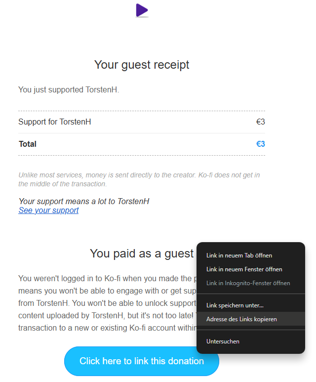
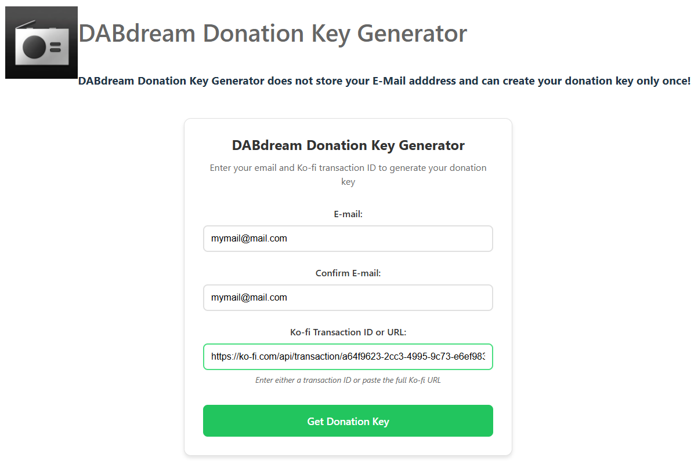
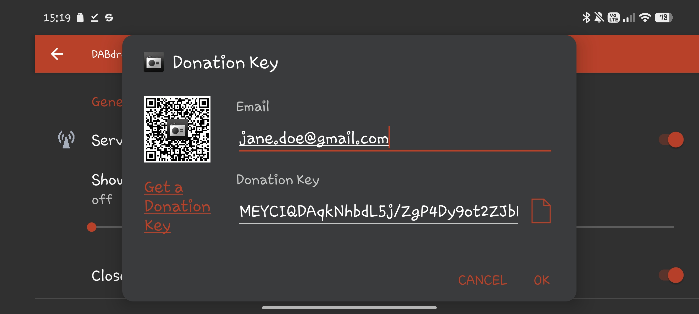

# Donation Key

How to get a DABdream Donation Key

⚠️ Please complete **ALL** the steps described on this page. Placing your donation is not the final step - there's more to do...

## Place a Donation

Visit [Ko-fi](https://ko-fi.com/appswitcher) to place a donation. Then, proceed to the next step if you’re interested in receiving a Donation Key.
If you’ve already donated, you can skip this step - but you must continue with the next one.

## Get Transaction Details

To get a Donation Key you need the Ko-fi Transaction ID or the URL pointing to your Ko-fi donation.

### Option 1: Get the Ko-fi Transaction ID from the Ko-fi email

Check the email you received **from Ko-fi** and copy one of the URLs linking to your donation.

Do not copy any transaction ID from your payment provider (e.g. PayPal) - this will not work.

### Option 2: Get the Ko-fi Transaction ID from your payment provider

The payment provider (e.g. PayPal) shows the Ko-fi Transcation ID as billing number, other payment provider may name it reference number. The Ko-fi Tranaction ID has this format: xxxxxxxx-xxxx-xxxx-xxxx-xxxxxxxxxxxx

Do not copy the PayPal transaction number as it has a different format and it will not work.

## Get the Donation Key

⚠️ **Please note:**
- The Donation Key Generator does not store your email address
- You can use a transaction only **once** to get a Donation Key

1. Open the [Donation Key Generator](https://donation-ui-delta.vercel.app/)
2. Enter your email address and the copied URL or the Ko-fi Transaction ID:

⚠️ You must use the link copied in the previous step or your Ko-fi Transaction ID. Other IDs (e.g., from PayPal or other payment providers) are **not valid**.

3. Click the **Get Donation Key** button .

4. As a result, you will receive your Donation Key. Download the Donation Key as .txt file with the button .

Save the .txt file securely, as you cannot generate the Donation Key again.

## Enter the Donation Key

Transfer the downloaded .txt file to your head unit. DABdream allows to import the Donation Key from the file with the button . 

As some head units lack of the feature to select files, you can also manually copy and paste the **entire key** into the input field.
